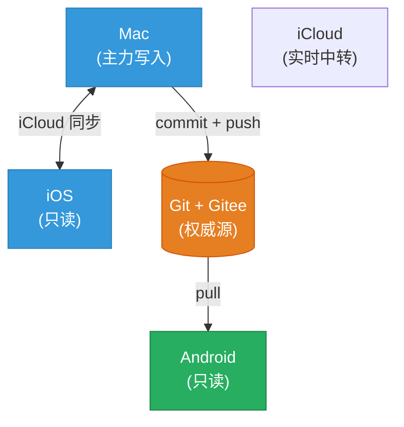

# Obsidian 多端同步:iCloud + Git 双轨方案

> **教程版本**:v1.0
> **最后更新**:2026-09-13
> **适用对象**:想把 Obsidian vault 同步到 Gitee(或其他 Git 远端)的用户
> **预计时间**:60-90 分钟

---

## 目录

- [前言](#前言)
  - [让 AI 协助你](#让-ai-协助你)
- [准备工作](#一-准备工作)
- [阶段一:本地仓库初始化](#阶段一本地仓库初始化)
- [阶段二:创建 Gitee 私有仓库](#阶段二创建-gitee-私有仓库)
- [阶段三:绑定远端并首次推送](#阶段三绑定远端并首次推送)
- [阶段四:配置 Obsidian Git 插件](#阶段四配置-obsidian-git-插件)
- [阶段五:多设备同步](#阶段五多设备同步)
- [常见问题](#常见问题)
- [进阶配置](#进阶配置)

---

## 前言

### 为什么要同步 Obsidian 到 Gitee?

我原本只使用 iPhone 和 Mac，通过 iCloud 同步 Obsidian 笔记。后来因工作需要，新增了一台安卓设备。为了把笔记分发到这台设备，我把 Gitee 作为 Git 远端中转：Mac 端 commit + push，安卓端再 pull 下来。

这个方案的架构如下图所示。由于安卓端基本只能只读，写入操作的配置会比较复杂——而我并没有安卓端写入的需求，所以这套方案刚好够用。

| 备份方式                        | 优点                  | 缺点        |
| --------------------------- | ------------------- | --------- |
| 仅 iCloud                    | 实时同步                | 无版本历史,易冲突 |
| 仅 Git                       | 版本历史,多设备            | 移动端体验差    |
| **iCloud + Gitee Git**(本教程) | **实时 + 版本历史 + 多设备** | 配置稍复杂     |

### 架构概览



> GitHub / Obsidian 会自动渲染上述 Mermaid 图;若你用其他 Markdown 编辑器看不到图,可参考公众号版的 ASCII box drawing 替代。

---
### 让 AI 协助你

本教程步骤较多,如果你不熟悉 Git 命令,可以借助 AI 大幅简化操作:

**AI 可以帮你**:
- 生成命令:把"我想把 `<vault 路径>` 初始化为 git 仓库,绑定远端 https://gitee.com/xxx/notes_obsidian.git,首次 push"丢给 AI,直接拿到命令序列
- 解读报错:终端报错信息复制给 AI,它会告诉你哪里错了、怎么修
- 验证结果:`git status` / `git remote -v` 的输出贴给 AI,确认是否正常

**推荐 prompt 模板**:
> 我想把 `<vault 路径>` 这个 Obsidian vault 初始化为 git 仓库,配置 .gitignore 忽略 .obsidian/ 和 macOS 系统文件,绑定远端 `<你的 Gitee 仓库 URL>`,然后首次 commit + push。请逐步指导,每一步告诉我做什么、为什么这么做、出错了怎么排查。

**AI 帮不了的部分**(需要你自己操作):
- Gitee 网页上的图形界面操作(创建仓库、生成 Token)
- 保管 Token(涉及账户安全,不要让 AI 拿到)

---

## 一、准备工作

### 1.1 环境检查

#### Mac 端
- ✅ macOS 任意版本
- ✅ 已安装 Git(终端运行 `git --version`,应该返回 2.x)
- ✅ 已安装 Obsidian
- ✅ vault 已有内容(可选,但推荐)

#### iOS 端(可选)
- ✅ 已安装 Obsidian

#### Android 端(可选)
- ✅ 已安装 Obsidian
- ✅ 已安装 Termux(免费,Play Store)

### 1.2 工具准备

| 工具              | 用途             | 下载                                  |
| --------------- | -------------- | ----------------------------------- |
| Obsidian Git 插件 | 自动 commit/push | Obsidian 社区插件                       |
| Gitee           | 私有 Git 仓库      | [gitee.com](https://gitee.com) 注册账号 |
| Termux(Android) | 命令行 git        | Play Store                          |
选择 Gitee 的原因是它在国内的访问体验更稳定；GitHub 在国内的网络环境下速度较慢，配置也更麻烦，所以选 Gitee 更省心。

---

## 阶段一:本地仓库初始化

⏱️ **预计时间**:10 分钟

### 1.1 创建 `.gitignore`

在 vault 根目录创建 `.gitignore` 文件,内容如下:

```gitignore
# macOS
.DS_Store

# Obsidian 全部本地配置(整目录 ignore,跨设备无意义)
.obsidian/

# Obsidian 隐藏文件支持
.hidden

# Obsidian 回收站
.trash/

# Obsidian Bases
*.base
*.base.lock

# 本地 AI 工具配置
.claude/
.codex/
.agents/
.claudian/

# 本地工具缓存
.dashboard-backup/
.weread-cache/

# 临时文件
*.swp
*.tmp
*~

# iCloud 同步兼容
*.icloud
*.crdownload
*.download
.DocumentRevisions-V100/
.TemporaryItems/
.fseventsd/
.Spotlight-V100/
.Trashes/
.VolumeIcon.icns
.AppleDouble
.AppleDB
.AppleDesktop
Network Trash Folder
Temporary Items
.apdisk
```

> **为什么忽略 `.obsidian/`**:它包含本地配置(主题、快捷键、插件),跨设备同步意义不大,反而会污染 git 历史。
>
> **如果你的 `.obsidian/` 里有需要同步的内容**(比如自定义 CSS),见文末「进阶配置」。

### 1.2 初始化 Git 仓库

在 vault 根目录打开终端,执行:

```bash
cd /path/to/your/vault

git init
```

### 1.3 配置 Git 用户信息

```bash
# 在 vault 目录设置(只对这个仓库生效)
git config user.name "你的名字"
git config user.email "your_email@example.com"

# 或全局设置(所有仓库生效)
git config --global user.name "你的名字"
git config --global user.email "your_email@example.com"
```

### 1.4 预览将要提交的文件

```bash
git add -n .
```

**检查清单**:
- ✅ 只看到你的笔记/图片/附件
- ❌ 不应看到 `.obsidian/` `.claude/` 等

### 1.5 首次提交

```bash
git add .
git commit -m "init vault"
```

### 1.6 验证

```bash
git status
# 应该显示: nothing to commit, working tree clean

git log --oneline
# 应该显示一行: <commit hash> init vault
```

---

## 阶段二:创建 Gitee 私有仓库

⏱️ **预计时间**:5 分钟

### 2.1 新建仓库

1. 登录 [Gitee](https://gitee.com)
2. 右上角 `+` → **新建仓库**
3. 填写:
   - **仓库名称**:`notes_obsidian`(或你喜欢的名字)
   - **归属**:个人空间
   - **是否开源**:**私有** ⚠️ 重要!
   - **初始化仓库**:❌ **不勾选** README / .gitignore / License
   - **分支模型**:默认即可
4. 点击 **创建**

### 2.2 生成访问令牌

1. Gitee 右上角头像 → **设置**
2. 左侧菜单 → **私人令牌**
3. 点击 **生成新令牌**
4. 填写:
   - **令牌描述**:`obsidian-vault`
   - **权限范围**:✅ **必须勾选 `projects`**
5. 点击 **提交**
6. **复制并保存令牌**(关闭页面后无法再查看)

> **安全提示**:
> - 令牌类似密码,不要分享或写入 vault 内任何 .md 文件
> - 推荐存到密码管理器(1Password / Bitwarden / macOS 钥匙串)

---

## 阶段三:绑定远端并首次推送

⏱️ **预计时间**:5 分钟

### 3.1 绑定远端

```bash
cd /path/to/your/vault

git remote add origin https://gitee.com/你的用户名/notes_obsidian.git
```

### 3.2 验证绑定

```bash
git remote -v
```

应该看到:
```
origin  https://gitee.com/你的用户名/notes_obsidian.git (fetch)
origin  https://gitee.com/你的用户名/notes_obsidian.git (push)
```

### 3.3 首次推送

```bash
git push -u origin main
```

**会提示**:
```
Username for 'https://gitee.com': 你的用户名
Password for 'https://gitee.com': <粘贴你的令牌>
```

### 3.4 验证推送

1. 浏览器打开 `https://gitee.com/你的用户名/notes_obsidian`
2. 应该能看到 vault 的所有文件

---

## 阶段四:配置 Obsidian Git 插件

⏱️ **预计时间**:10 分钟

### 4.1 安装插件

1. Obsidian → **设置** → **第三方插件**
2. 关闭 **安全模式**
3. 点击 **浏览社区插件**
4. 搜索 **"Git"**
5. 找到 **Obsidian Git**(作者:Vinzent)
6. 点击 **安装** → **启用**

### 4.2 配置自动同步

打开 Obsidian Git 的设置页:

| 设置项 | 推荐值 | 说明 |
|---|---|---|
| Auto commit-and-sync interval | `15` | 15 分钟自动 commit + push |
| Auto pull interval | `15` | 15 分钟自动 pull |
| Auto commit-and-sync after stopping file edits | ✅ 开启 | 停笔自动触发 |
| Push on commit-and-sync | ✅ 开启 | commit 后自动 push |
| Pull on commit-and-sync | ✅ 开启 | commit 前先 pull |
| Commit message | `vault backup: {{date}}` | 默认即可 |
| Date format | `YYYY-MM-DD HH:mm:ss` | |
| Merge strategy | `merge` | 比 rebase 安全 |

### 4.3 配置作者信息

在设置页找 **Git config** 区段(可能需要展开折叠):

| 设置项 | 值 |
|---|---|
| Author name | `<你的 Git 用户名>` |
| Author email | `<你的邮箱>` |

### 4.4 配置凭证

**重要**:Obsidian Git 插件 v2.39.0 在设置页**没有 Token 字段**。需要通过终端触发一次 push,让 Git 自动把 Token 存进 macOS 钥匙串:

```bash
cd /path/to/your/vault
git pull origin main
```

会提示输入账号密码,输完一次后,以后就不需要再输入了。

> **如果不想用钥匙串**,可以在 Obsidian Git 设置页找 **Git config** 区段,**部分版本**有 Username + Password 字段,直接填入。

### 4.5 测试

1. 在 Obsidian 里随便改一个笔记
2. 等 **15 分钟**(或点击 ribbon 上的 Git 图标 → "Commit-and-sync")
3. 去 Gitee 网页 → Commits 页 → 应该看到新 commit `vault backup: ...`

---

## 阶段五:多设备同步

⏱️ **预计时间**:20-30 分钟

### 5.1 iOS 端(走 iCloud)

如果你把 vault 放在 iCloud Drive 同步目录,iOS 端 Obsidian 直接打开同一文件夹即可,**无需额外配置**。

#### 设置步骤

1. Mac 端:把 vault 移动到 iCloud Drive 同步目录(例如 `<你的 iCloud Drive 路径>`)
2. iOS 端:打开 Obsidian → **Create vault** → 选同一文件夹
3. iCloud 自动同步,**完全无需 git 配置**

#### 注意事项
- iCloud 同步可能有数秒延迟
- **不要**在 iOS 和 Mac 同时编辑同一笔记(会冲突)

### 5.2 Android 端(走 Termux + Git)

#### 步骤 1:安装 Termux

1. Play Store 搜索 **Termux** → 安装
2. 打开 Termux,执行:

```bash
pkg update -y
pkg install git -y
termux-setup-storage
```

#### 步骤 2:配置凭证(只跑一次)

```bash
git config --global credential.helper store
git config --global user.name "<你的 Git 用户名>"
git config --global user.email "<你的邮箱>"
```

#### 步骤 3:Clone Gitee 仓库

```bash
git clone https://gitee.com/你的用户名/notes_obsidian.git
```

仓库会 clone 到 `~/notes_obsidian`。

#### 步骤 4:复制到 Obsidian 能访问的目录

```bash
cp -r ~/notes_obsidian /storage/emulated/0/Documents/
```

#### 步骤 5:在 Obsidian Android 切换 vault

1. 打开 Obsidian Android
2. **设置** → **Vault** → **Open folder as vault**
3. 选 `/storage/emulated/0/Documents/notes_obsidian`

#### 步骤 6:创建一键同步脚本

```bash
cat > ~/sync-vault.sh << 'EOF'
#!/bin/bash
cd ~/notes_obsidian
git pull origin main
cp -r ~/notes_obsidian/. /storage/emulated/0/Documents/notes_obsidian/
echo "✅ vault 已同步并复制到 Documents ($(date))"
EOF

chmod +x ~/sync-vault.sh
```

#### 日常使用

```bash
~/sync-vault.sh
```

然后**完全关闭 Obsidian Android**(从最近任务划掉) → 重新打开,看到新内容。

---

## 常见问题

### Q1:`Authentication failed`

**原因**:Token 错或过期。
**解法**:Gitee 设置 → 私人令牌 → 重新生成 → 更新到各端凭证。

### Q2:`! [rejected] main -> main (fetch first)`

**原因**:Gitee 端有内容,与本地冲突。
**解法**:
```bash
git pull --rebase origin main
git push origin main
```

### Q3:Mac 端 push 成功,但 Android 看不到更新

**可能 1**:Documents 镜像没更新。
**解法**:跑 `~/sync-vault.sh`

**可能 2**:Obsidian 缓存。
**解法**:完全关闭 Obsidian(从最近任务划掉) → 重新打开。

### Q4:Android 端报 "Can't find a valid git repository"

**原因**:Obsidian Android 没装 Obsidian Git 插件,或 vault 不是 git 仓库。
**解法**:确认 Obsidian Git 插件已装,vault 文件夹里有 `.git/` 目录。

### Q5:每次 pull 都要输 Token

**解法**:
```bash
git config --global credential.helper store
# 之后第一次会问,以后从 ~/.git-credentials 读
```

### Q6:iCloud 同步冲突

**症状**:出现 `xxx (Conflict).md` 文件。
**解法**:手动删除冲突文件,把正确版本保留为原文件名。

### Q7:Mac 端 `.git/` 占空间太大

**解法**:在 Obsidian Git 设置 → **Commit retention** → 设为 `10`(只留 10 个 commit)。

### Q8:如何撤销某次 commit

```bash
# 撤销最近一次 commit(保留改动)
git reset --soft HEAD~1

# 撤销最近一次 commit(丢弃改动)⚠️ 危险
git reset --hard HEAD~1
```

---

## 进阶配置

### 进阶 1:只同步 `.obsidian/plugins/`(保留插件二进制)

如果你希望 Android 端也能用 Obsidian Git 插件,不要 ignore 整个 `.obsidian/`:

```gitignore
# 只 ignore 配置和数据,保留插件二进制
.obsidian/workspace.json
.obsidian/workspace-mobile.json
.obsidian/workspace-tab-*.json
.obsidian/plugins/*/data.json
.obsidian/plugins/*/backups/
.obsidian/cache/
```

然后用 `git rm --cached -r .obsidian/` 移除现有跟踪(但保留本地文件)。

### 进阶 2:用 SSH 替代 HTTPS(更安全)

```bash
# 生成 SSH key
ssh-keygen -t ed25519 -C "your_email@example.com"

# 复制公钥
cat ~/.ssh/id_ed25519.pub

# Gitee → 设置 → SSH 公钥 → 添加
```

然后把 remote 改为 SSH:

```bash
git remote set-url origin git@gitee.com:你的用户名/notes_obsidian.git
```

### 进阶 3:多台电脑都自动 push

如果有 2 台 Mac,两台都装 Obsidian Git 插件,设置相同的 interval 即可。两台都会自动 commit + push,Git 会处理冲突。

### 进阶 4:每天定时备份

```bash
# macOS launchd 定时任务
# 在 ~/Library/LaunchAgents/com.user.obsidian-backup.plist 写入:

<?xml version="1.0" encoding="UTF-8"?>
<!DOCTYPE plist PUBLIC "-//Apple//DTD PLIST 1.0//EN" "http://www.apple.com/DTDs/PropertyList-1.0.dtd">
<plist version="1.0">
<dict>
    <key>Label</key>
    <string>com.user.obsidian-backup</string>
    <key>ProgramArguments</key>
    <array>
        <string>/bin/bash</string>
        <string>-c</string>
        <string>cd /path/to/vault && git add . && git commit -m "auto backup" && git push</string>
    </array>
    <key>StartCalendarInterval</key>
    <dict>
        <key>Hour</key>
        <integer>23</integer>
        <key>Minute</key>
        <integer>0</integer>
    </dict>
</dict>
</plist>
```

加载:

```bash
launchctl load ~/Library/LaunchAgents/com.user.obsidian-backup.plist
```

---

## 附录:完整命令速查

```bash
# ===== Mac 端 =====
cd /path/to/vault
git init
git config user.name "<你的 Git 用户名>"
git config user.email "<你的邮箱>"
git add . && git commit -m "init vault"
git remote add origin https://gitee.com/USERNAME/notes_obsidian.git
git push -u origin main

# ===== Android Termux =====
pkg update -y && pkg install git -y
termux-setup-storage
git config --global credential.helper store
git config --global user.name "<你的 Git 用户名>"
git config --global user.email "<你的邮箱>"
git clone https://gitee.com/USERNAME/notes_obsidian.git
cp -r ~/notes_obsidian /storage/emulated/0/Documents/

# 一键同步
~/sync-vault.sh

# ===== 撤销 / 重建 =====
# 重置 Android vault 到最新
cd ~/notes_obsidian && git reset --hard origin/main

# 重置 Mac vault 到最新(⚠️ 丢未 commit 改动)
cd /path/to/vault && git reset --hard origin/main

# 完全重建
rm -rf .git
git init
git remote add origin https://gitee.com/USERNAME/notes_obsidian.git
git fetch origin
git reset --hard origin/main
```

---

## 版本历史

| 版本 | 日期 | 变更 |
|---|---|---|
| v1.0 | 2026-09-13 | 初版,基于实际项目经验整理 |

---

## 反馈

> 本教程的内容整理与润色由 AI 协助完成,所有命令、配置、流程均经过本人实际操作验证。

本文是我个人摸索出的一次初步尝试,细节上难免有疏漏或不够严谨的地方。

如果你发现错误、有更好的方案,或者只是想交流一下,欢迎通过以下渠道找到我——**互相学习,互相进步**。

- **GitHub**:[github.com/coolbarry/notes-sync-tutorial](https://github.com/coolbarry/notes-sync-tutorial)
- **Gitee**:[gitee.com/BarryByBy/notes-sync-tutorial](https://gitee.com/BarryByBy/notes-sync-tutorial)
- **微信公众号**:**小白不想做小白**(搜索关注)
