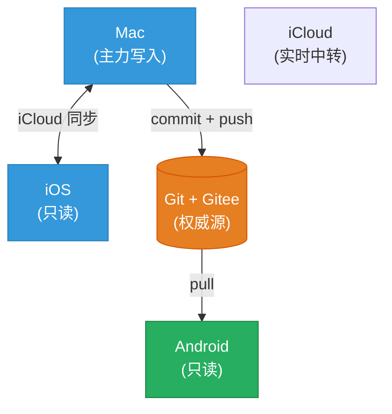

# Obsidian 笔记多端同步 · iCloud + Git 双轨方案

> 把 Obsidian vault 通过 iCloud(实时) + Gitee(版本历史 + 多设备)双轨同步,实现 Mac/iOS 实时写入 + Android 只读。

完整教程请见 → **[Obsidian 笔记多端同步(iCloud + Git 双轨方案)](./Obsidian%20笔记多端同步(iCloud%20+%20Git%20双轨方案).md)**

---

## 这是什么

一个让 Obsidian vault 在 Mac / iOS / Android 多端同步的方案:

- **iCloud** 负责 Mac ↔ iOS 实时同步(主力写入端)
- **Git + Gitee** 负责版本历史 + 跨平台分发(Android 只读)

核心思路:把 Gitee 当成"Git 远端中转",Mac 端 commit + push,Android 端 pull 下来。

**适合你,如果**:
- 你用 Mac + iPhone + Android 三件套(或类似组合)
- 主要在 Mac/iPhone 写笔记,Android 端只是偶尔翻看
- 你愿意学一点点 Git(教程假设零基础)

**不太适合**,如果:
- 你需要在 Android 端频繁编辑笔记(本方案 Android 只读)
- 你的 vault 很大(超过 1GB,Git 仓库会臃肿)
- 你完全不想碰命令行

## 5 阶段速览

| 阶段 | 做什么 | 时间 |
|---|---|---|
| 一 | 本地仓库初始化(`.gitignore` + `git init`) | 10 分钟 |
| 二 | 创建 Gitee 私有仓库 + 生成 Token | 5 分钟 |
| 三 | 绑定远端 + 首次 push | 5 分钟 |
| 四 | 配置 Obsidian Git 插件(自动同步) | 10 分钟 |
| 五 | 多设备同步(iCloud 配 iOS / Termux 配 Android) | 20-30 分钟 |

**总计**:60-90 分钟。

## 反馈

本教程是个人摸索出的初步尝试,细节上难免有疏漏。

如果你发现错误、有更好的方案,或者只是想交流一下——**互相学习,互相进步**。

- GitHub: [github.com/coolbarry/notes-sync-tutorial](https://github.com/coolbarry/notes-sync-tutorial)
- Gitee: [gitee.com/BarryByBy/notes-sync-tutorial](https://gitee.com/BarryByBy/notes-sync-tutorial)
- 微信公众号:**小白不想做小白**(搜索关注)

> 本 README 的内容整理与润色由 AI 协助完成,所有命令、配置、流程均经过本人实际操作验证。